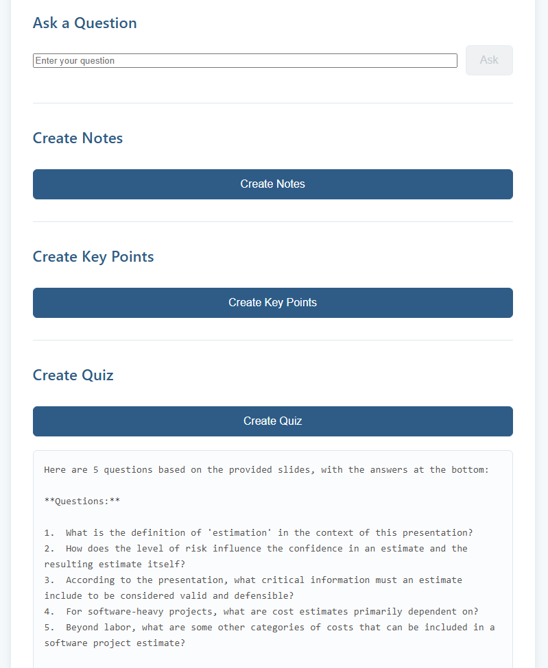
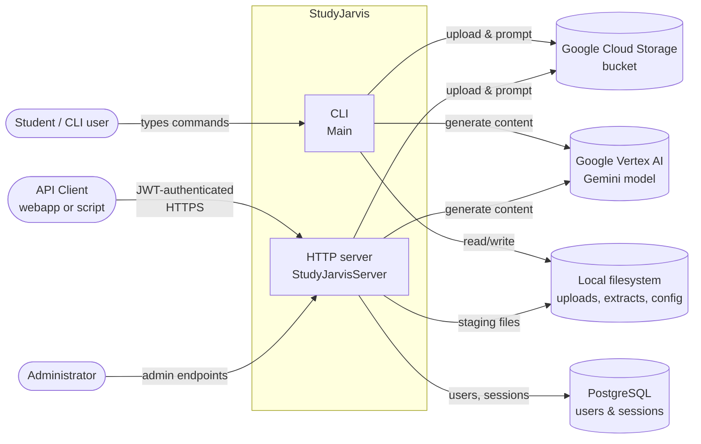

# StudyJarvis

[](https://github.com/Thomas-J-Barreras-Consulting/studyjarvis/actions/workflows/ci.yml)

> Turn lecture PDFs and PowerPoints into study artifacts — comprehensive notes, key points, study guides, and interactive quizzes — using Google Gemini on Vertex AI.



*UI shown is a placeholder screenshot of the Angular companion webapp; a higher-fidelity shot will replace it.*

## What it does

- **Ingests** PDFs and PowerPoints uploaded through a REST API (or a local CLI).
- **Extracts** text and per-slide images via Apache PDFBox and POI, stages them to Google Cloud Storage.
- **Prompts** Gemini multi-modally — per-slide images as `fileData` URIs, extracted text inlined — to produce notes, study guides, key points, and quizzes on demand.
- **Authenticates** multi-user access with JWT-signed sessions backed by PostgreSQL.

Runs in two modes that share the same core pipeline:

- **HTTP server** — Javalin app with JWT auth, OpenAPI/ReDoc docs at `/api/docs`, Postgres-backed users/sessions. Default target.
- **CLI** — single-user interactive shell for local exploration; no DB needed.

## Tech stack

| Layer | Tech |
| --- | --- |
| **Backend** | Java 17, Gradle 8.5, Javalin 6.4, PostgreSQL 16 |
| **AI / Storage** | Google Vertex AI (Gemini 2.5), Google Cloud Storage |
| **Document extraction** | Apache PDFBox 3, Apache POI 5 |
| **Auth** | `auth0/java-jwt` HMAC256, `jBCrypt` password hashing |
| **API docs** | Javalin OpenAPI annotation processor → ReDoc |
| **Testing** | JUnit 5.14, three Gradle source sets (unit / functional / integration), JaCoCo coverage |
| **CI** | GitHub Actions with an ephemeral Postgres service container |
| **Companion webapp** | Angular 19, TypeScript (separate [repo](../studyjarviswebapp-tjb/studyjarviswebapp)) |
| **Dev loop** | `dev.ps1` one-command launcher (backend + webapp), VS Code + IntelliJ supported |

## Architecture overview



Full container / component / sequence / data-model diagrams live in [docs/diagrams/](docs/diagrams/).

## Engineering highlights

- **Multi-modal LLM integration against Vertex AI.** Per-slide PNG images flow as `fileData` URIs; extracted text is downloaded from GCS and inlined as string parts because Gemini 2.x stopped accepting `text/plain` via `fileData`. The split is transparent to callers ([Gemini.java](src/main/java/com/christophertbarrerasconsulting/studyjarvis/Gemini.java)).
- **Multi-tenant object storage.** Every GCS object is namespaced under `users/<userId>/`, and all paths pass through a URI-safe sanitizer so user filenames can't break Vertex AI's `gs://` parser. Regression-tested in [GoogleBucketTest.java](src/test/java/com/christophertbarrerasconsulting/studyjarvis/GoogleBucketTest.java).
- **JWT-authenticated handlers with a decorator pattern.** `AuthorizationHandler` wraps each secured route; JWT signing is HMAC256 with a keyed secret from env ([JWTUtil.java](src/main/java/com/christophertbarrerasconsulting/studyjarvis/server/JWTUtil.java)), decoupled from the handler implementations.
- **Generated OpenAPI + interactive docs.** Javalin's OpenAPI annotation processor emits a schema at build time; ReDoc renders it at `/api/docs`, zero hand-maintained swagger files.
- **Three-tier test strategy.** `test` runs pure unit tests. `functionalTest` spins up the server with Postgres + stubs but skips GCP-calling tests, so CI can run it against an ephemeral Postgres service container. `integrationTest` exercises the full Vertex AI + GCS pipeline — manually run before releases. See [build.gradle](build.gradle) for the source-set wiring (`extendsFrom testImplementation`, task exclusions).
- **CI with a real database.** [.github/workflows/ci.yml](.github/workflows/ci.yml) uses GitHub Actions services to run Postgres 16 alongside the build so functional tests hit a real JDBC connection, not a mock.
- **Dev ergonomics.** [dev.ps1](dev.ps1) starts backend + webapp in two pwsh windows with env sourced from a gitignored file. VS Code config committed (`.vscode/extensions.json`, `.vscode/launch.json`) gives one-click extension install and a ready-made "Attach to Gradle Test" debug config on port 5005.

## Quick start

Prerequisites on Windows: JDK 17, Postgres running locally, `gcloud auth application-default login`, and a populated `%APPDATA%\studyjarvis.properties` (keys listed below).

```powershell
Copy-Item dev.env.example.ps1 dev.env.ps1
# edit dev.env.ps1 with your DB password and a JWT secret
.\dev.ps1
```

Two pwsh windows open — backend on `http://localhost:7000` (ReDoc at `/api/docs`), webapp on `http://localhost:4200`.

Just want the backend?

```bash
./gradlew run
```

## Deep-dive documentation

- **[Architecture overview](docs/ARCHITECTURE.md)** — narrative walkthrough with embedded diagrams
- Diagrams:
  - [System context](docs/diagrams/context.md)
  - [Containers](docs/diagrams/containers.md)
  - [Server components](docs/diagrams/server-components.md)
  - [CLI commands](docs/diagrams/cli-commands.md)
  - [Sequence — ask a question](docs/diagrams/sequence-ask-question.md)
  - [Sequence — login & JWT](docs/diagrams/sequence-auth.md)
  - [Sequence — interactive quiz](docs/diagrams/sequence-interactive-quiz.md)
  - [Data model](docs/diagrams/data-model.md)
  - [Deployment & config](docs/diagrams/deployment.md)

## Development

### Entry points

- Server: [StudyJarvisServer.java](src/main/java/com/christophertbarrerasconsulting/studyjarvis/server/StudyJarvisServer.java) (default `mainClass`, port 7000)
- CLI: [Main.java](src/main/java/com/christophertbarrerasconsulting/studyjarvis/Main.java)
- Core orchestration: [Jarvis.java](src/main/java/com/christophertbarrerasconsulting/studyjarvis/Jarvis.java), [Gemini.java](src/main/java/com/christophertbarrerasconsulting/studyjarvis/Gemini.java), [GoogleBucket.java](src/main/java/com/christophertbarrerasconsulting/studyjarvis/GoogleBucket.java)

### Configuration

Local properties file at:

- Windows: `%APPDATA%\studyjarvis.properties`
- macOS: `~/Library/Application Support/studyjarvis.properties`
- Linux: `~/.config/studyjarvis.properties`

Keys (see [AppSettings.java](src/main/java/com/christophertbarrerasconsulting/studyjarvis/file/AppSettings.java)): `BucketName`, `ExtractFolder`, `GeminiProjectId`, `GeminiModelName`, `GeminiLocation`.

Server-only environment variables:

- `STUDYJARVIS_DB_URL`, `STUDYJARVIS_DB_USER`, `STUDYJARVIS_DB_PASSWORD` — PostgreSQL connection
- `STUDYJARVIS_SERVER_SECRET_KEY` — HMAC key for JWT signing

Google Cloud credentials are picked up from the ambient environment (`GOOGLE_APPLICATION_CREDENTIALS` or `gcloud` application-default login).

### Build and run

```bash
./gradlew build                 # compile + unit tests
./gradlew functionalTest        # functional tests without GCP
./gradlew integrationTest       # full tests (requires GCP + Postgres)
./gradlew run                   # server; port 7000
```

Run the CLI — override `mainClass` via a project property. In PowerShell, quote the value so dots aren't parsed as member access:

```powershell
./gradlew run "-PmainClass=com.christophertbarrerasconsulting.studyjarvis.Main"
```

```bash
./gradlew run -PmainClass=com.christophertbarrerasconsulting.studyjarvis.Main
```

### Running tests in VS Code

When you open the backend folder in VS Code, accept the prompt to install the recommended extensions (**Extension Pack for Java** and **Gradle for Java**).

**Unit tests** (`src/test`) — no env vars needed. Open any test class and use the **Run Test** / **Debug Test** CodeLens above a `@Test` method, or the flask-icon Test Explorer sidebar.

**Functional / integration tests** (`src/functional`, `src/integration`) — the VS Code Test Explorer does not reliably discover these custom source sets, so run them via Gradle and attach the debugger:

1. Open a VS Code terminal and source env vars:

   ```powershell
   . .\dev.env.ps1
   ```

2. Run the Gradle task with JVM debug enabled:

   ```powershell
   .\gradlew functionalTest --debug-jvm        # or integrationTest
   ```

   Gradle prints `Listening for transport dt_socket at address: 5005` and pauses.

3. In **Run and Debug** (`Ctrl+Shift+D`), pick **Attach to Gradle Test (port 5005)** and press F5. Tests execute; breakpoints hit.

To run tests without the debugger, drop `--debug-jvm`, or use the Gradle extension's task panel (studyjarvis → Tasks → verification → `functionalTest` / `integrationTest`).
