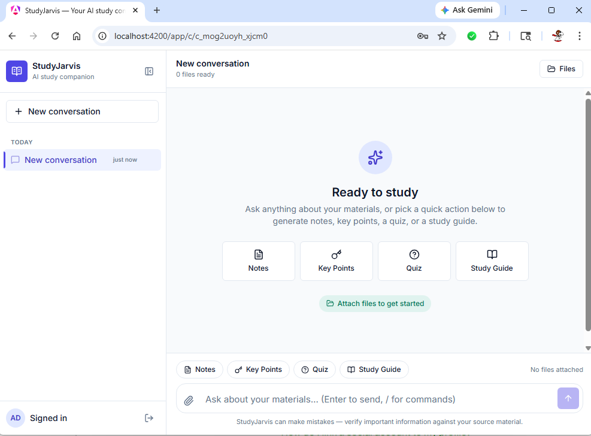
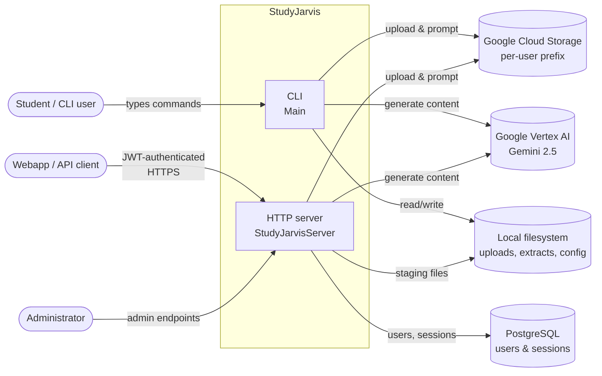
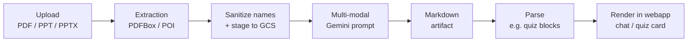
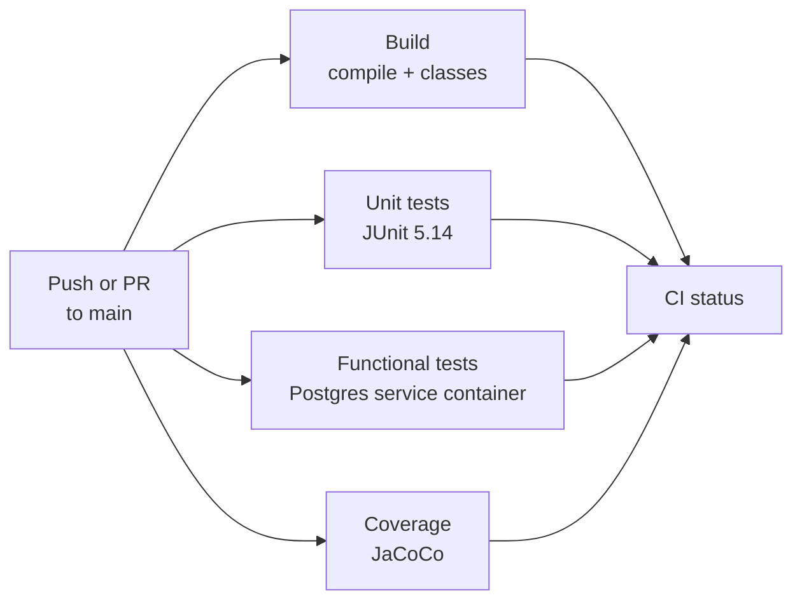

# StudyJarvis

[](https://github.com/Thomas-J-Barreras-Consulting/studyjarvis/actions/workflows/ci.yml)
[](https://www.oracle.com/java/)
[](https://cloud.google.com/vertex-ai)

**Turn lecture PDFs and PowerPoints into study artifacts — comprehensive notes, key points, study guides, and interactive quizzes — using Google Gemini on Vertex AI.**



## Overview

StudyJarvis ingests course material (PDFs, PowerPoints, legacy `.ppt`), extracts text and per-slide images, stages them in Google Cloud Storage, and prompts Vertex AI's Gemini multi-modally to produce study artifacts on demand. It runs in two modes that share a single core pipeline:

- **HTTP server** — Javalin app with JWT-authenticated endpoints, Postgres-backed users/sessions, and OpenAPI/ReDoc docs at `/api/docs`. Default target. Drives the [companion Angular webapp](https://github.com/Thomas-J-Barreras-Consulting/studyjarviswebapp).
- **CLI** — single-user interactive shell for local exploration; no DB required.

## Screenshots

<div align="center">

| Chat home | Ask | Comprehensive notes | Interactive quiz |
| :---: | :---: | :---: | :---: |
|  |  |  |  |

</div>

## Architecture



Container, component, sequence, data-model, and deployment diagrams: [docs/diagrams/](docs/diagrams/) · [Architecture narrative](docs/ARCHITECTURE.md).

## Tech stack

| Layer | Tech |
| --- | --- |
| **Language / Build** | Java 17, Gradle 8.5 (`application` plugin) |
| **HTTP / API** | Javalin 6.4, Jetty 11, Javalin OpenAPI annotation processor → ReDoc |
| **AI / Storage** | Google Vertex AI (Gemini 2.5), Google Cloud Storage |
| **Document extraction** | Apache PDFBox 3 (PDF), Apache POI 5 (PPT/PPTX) |
| **Persistence** | PostgreSQL 16, JDBC 42 |
| **Auth** | `auth0/java-jwt` HMAC256, `jBCrypt` password hashing |
| **Logging** | SLF4J + Logback |
| **Testing** | JUnit 5.14, three Gradle source sets (unit / functional / integration), JaCoCo coverage |
| **CI** | GitHub Actions with an ephemeral Postgres service container |
| **Companion webapp** | Angular 19, TypeScript ([studyjarviswebapp](https://github.com/Thomas-J-Barreras-Consulting/studyjarviswebapp)) |
| **Dev loop** | `dev.ps1` one-command launcher (backend + webapp), VS Code + IntelliJ supported |

## Methodology

The end-to-end pipeline that turns an uploaded file into a study artifact:



1. **Ingest & extract.** Uploads land in a per-user staging dir. PDFs go through PDFBox, decks through POI; both produce per-slide PNGs plus a per-slide text file. Legacy `.ppt` is supported via POI's HSLF.
2. **Stage to GCS.** Object names are namespaced under `users/<userId>/` and run through a URI-safe sanitizer so user filenames can't break Vertex AI's `gs://` parser ([GoogleBucket.java](src/main/java/com/christophertbarrerasconsulting/studyjarvis/GoogleBucket.java)). Regression-tested.
3. **Build a multi-modal prompt.** PNG slides flow as `fileData` URIs; the matching extracted text is downloaded from GCS and inlined as string parts because Gemini 2.x stopped accepting `text/plain` via `fileData`. This split is transparent to callers ([Gemini.java](src/main/java/com/christophertbarrerasconsulting/studyjarvis/Gemini.java)).
4. **Generate.** [Jarvis.java](src/main/java/com/christophertbarrerasconsulting/studyjarvis/Jarvis.java) exposes typed entry points — `createComprehensiveNotes`, `createKeyPoints`, `createStudyGuide`, `createQuiz`, `askQuestion`, plus an `InteractiveQuiz` flow — each backed by a small, deterministic prompt template.
5. **Render.** The webapp parses the model's markdown output (e.g. quizzes via [QuizParserService](https://github.com/Thomas-J-Barreras-Consulting/studyjarviswebapp/blob/main/src/app/chat/quiz/quiz-parser.service.ts)) into interactive UI cards.

## Engineering highlights

- **Multi-modal LLM integration against Vertex AI** — images as `fileData`, text inlined; survived the Gemini 2.x deprecation of `text/plain` `fileData`.
- **Multi-tenant object storage** — `users/<userId>/` prefix plus character allow-list sanitizer (`[A-Za-z0-9._/-]`); regression test in [GoogleBucketTest.java](src/test/java/com/christophertbarrerasconsulting/studyjarvis/GoogleBucketTest.java).
- **JWT-authenticated handlers, decorator pattern** — `AuthorizationHandler` wraps each secured route; HMAC256 secret is keyed from env, decoupled from handler implementations ([JWTUtil.java](src/main/java/com/christophertbarrerasconsulting/studyjarvis/server/JWTUtil.java)).
- **Generated OpenAPI + interactive docs** — Javalin's annotation processor emits a schema at compile time; ReDoc renders it at `/api/docs`. Zero hand-maintained Swagger.
- **Three-tier Gradle source sets** — `test` (pure unit), `functionalTest` (Postgres-backed, GCP-skipping, runs in CI), `integrationTest` (live GCP). Wired with `extendsFrom testImplementation` so IDE tooling resolves the JUnit classpath cleanly across all three.
- **CI with a real database** — [.github/workflows/ci.yml](.github/workflows/ci.yml) runs Postgres 16 as a GitHub Actions service container so functional tests hit a real JDBC connection, not a mock.
- **Dev ergonomics** — [dev.ps1](dev.ps1) launches backend + webapp in two pwsh windows with env sourced from a gitignored file. Committed `.vscode/extensions.json` + `.vscode/launch.json` give one-click extension install and a ready-made *Attach to Gradle Test (port 5005)* debug config that works for all three test source sets.

## Engineering & quality



| Tier | Task | What it covers | Where it runs |
| --- | --- | --- | --- |
| **Unit** | `./gradlew test` | Pure logic — parsers, sanitizers, password hashing, JSON config deserialization | Every push, in CI |
| **Functional (Tier 1+2)** | `./gradlew functionalTest` | File extraction (Tier 1) and JWT/session/handler flows hitting a real Postgres (Tier 2). GCP-touching tests are excluded. | Every push, in CI |
| **Integration (Tier 3)** | `./gradlew integrationTest` | Full Vertex AI + GCS round-trip with real credentials | Locally before releases |

Tests are organized as separate Gradle source sets ([build.gradle](build.gradle)) — see *Three-tier Gradle source sets* above. Unit-test highlights:

- `GoogleBucketTest` — locks in URI-safe sanitization rules so a future filename containing `:` or spaces can't quietly break Vertex AI again.
- `quiz-parser.service.spec.ts` (in the webapp repo) — guards a regression where Gemini's plain `Answers:` line was being mis-parsed as more questions, doubling the rendered quiz length.

## Quick start

Prerequisites on Windows: JDK 17, Postgres running locally, `gcloud auth application-default login`, and a populated `%APPDATA%\studyjarvis.properties` (keys listed in [Configuration](#configuration)).

```powershell
Copy-Item dev.env.example.ps1 dev.env.ps1
# edit dev.env.ps1 with your DB password and a JWT secret
.\dev.ps1
```

Two pwsh windows open — backend on `http://localhost:7000` (ReDoc at `/api/docs`), webapp on `http://localhost:4200`.

Backend only:

```bash
./gradlew run
```

## Deep-dive documentation

- **[Architecture overview](docs/ARCHITECTURE.md)** — narrative walkthrough with embedded diagrams
- Diagrams:
  - [System context](docs/diagrams/context.md)
  - [Containers](docs/diagrams/containers.md)
  - [Server components](docs/diagrams/server-components.md)
  - [CLI commands](docs/diagrams/cli-commands.md)
  - [Sequence — ask a question](docs/diagrams/sequence-ask-question.md)
  - [Sequence — login & JWT](docs/diagrams/sequence-auth.md)
  - [Sequence — interactive quiz](docs/diagrams/sequence-interactive-quiz.md)
  - [Data model](docs/diagrams/data-model.md)
  - [Deployment & config](docs/diagrams/deployment.md)

## Development

### Entry points

- Server: [StudyJarvisServer.java](src/main/java/com/christophertbarrerasconsulting/studyjarvis/server/StudyJarvisServer.java) (default `mainClass`, port 7000)
- CLI: [Main.java](src/main/java/com/christophertbarrerasconsulting/studyjarvis/Main.java)
- Core orchestration: [Jarvis.java](src/main/java/com/christophertbarrerasconsulting/studyjarvis/Jarvis.java), [Gemini.java](src/main/java/com/christophertbarrerasconsulting/studyjarvis/Gemini.java), [GoogleBucket.java](src/main/java/com/christophertbarrerasconsulting/studyjarvis/GoogleBucket.java)

### Configuration

Local properties file at:

- Windows: `%APPDATA%\studyjarvis.properties`
- macOS: `~/Library/Application Support/studyjarvis.properties`
- Linux: `~/.config/studyjarvis.properties`

Keys (see [AppSettings.java](src/main/java/com/christophertbarrerasconsulting/studyjarvis/file/AppSettings.java)): `BucketName`, `ExtractFolder`, `GeminiProjectId`, `GeminiModelName`, `GeminiLocation`.

Server-only environment variables:

- `STUDYJARVIS_DB_URL`, `STUDYJARVIS_DB_USER`, `STUDYJARVIS_DB_PASSWORD` — PostgreSQL connection
- `STUDYJARVIS_SERVER_SECRET_KEY` — HMAC key for JWT signing

Google Cloud credentials are picked up from the ambient environment (`GOOGLE_APPLICATION_CREDENTIALS` or `gcloud` application-default login).

### Build and run

```bash
./gradlew build                 # compile + unit tests
./gradlew functionalTest        # functional tests without GCP
./gradlew integrationTest       # full tests (requires GCP + Postgres)
./gradlew run                   # server; port 7000
```

Run the CLI — override `mainClass` via a project property. In PowerShell, quote the value so dots aren't parsed as member access:

```powershell
./gradlew run "-PmainClass=com.christophertbarrerasconsulting.studyjarvis.Main"
```

```bash
./gradlew run -PmainClass=com.christophertbarrerasconsulting.studyjarvis.Main
```

### Running tests in VS Code

When you open the backend folder in VS Code, accept the prompt to install the recommended extensions (**Extension Pack for Java** and **Gradle for Java**).

**Unit tests** (`src/test`) — no env vars needed. Open any test class and use the **Run Test** / **Debug Test** CodeLens above a `@Test` method, or the flask-icon Test Explorer sidebar.

**Functional / integration tests** (`src/functional`, `src/integration`) — the VS Code Test Explorer does not reliably discover these custom source sets, so run them via Gradle and attach the debugger:

1. Open a VS Code terminal and source env vars:

   ```powershell
   . .\dev.env.ps1
   ```

2. Run the Gradle task with JVM debug enabled:

   ```powershell
   .\gradlew functionalTest --debug-jvm        # or integrationTest
   ```

   Gradle prints `Listening for transport dt_socket at address: 5005` and pauses.

3. In **Run and Debug** (`Ctrl+Shift+D`), pick **Attach to Gradle Test (port 5005)** and press F5. Tests execute; breakpoints hit.

To run tests without the debugger, drop `--debug-jvm`, or use the Gradle extension's task panel (studyjarvis → Tasks → verification → `functionalTest` / `integrationTest`).
