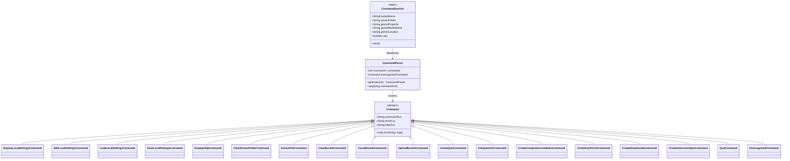

# CLI Commands

The CLI is a classic Command pattern: a single abstract [Command](../../src/main/java/com/christophertbarrerasconsulting/studyjarvis/command/Command.java) with one concrete subclass per user-typeable command. [CommandParser](../../src/main/java/com/christophertbarrerasconsulting/studyjarvis/command/CommandParser.java) matches the first token of each input line against each command's `commandText` or `shortCut` and dispatches.

## Command reference

| Command | Shortcut | Purpose |
| --- | --- | --- |
| `load-settings` | `ls` | Read `studyjarvis.properties` into `CommandSession` (run at startup by `Main`). |
| `display-settings` | `ds` | Print current settings. |
| `edit-settings` | `es` | Interactively edit and save settings. |
| `save-settings` | `ss` | Save current settings to disk. |
| `help` | `h` | Print help text for all commands. |
| `extract-file` | `ef` | Extract one file into the local extract folder. |
| `clear-extract-folder` | `cf` | Delete everything in the local extract folder. |
| `upload-bucket` | `ub` | Upload the extract folder's contents to GCS. |
| `count-bucket` | `kb` | Count objects in the GCS bucket. |
| `clear-bucket` | `cb` | Delete objects in the GCS bucket (default user prefix). |
| `ask-question` | `aq` | Prompt Gemini with a question against the prepared bucket context. |
| `create-notes` | `cn` | Generate comprehensive notes. |
| `create-key-points` | `kp` | Generate key points. |
| `create-study-guide` | `sg` | Generate a Q&A study guide. |
| `create-quiz` | `cq` | Generate a static quiz of size N. |
| `create-interactive-quiz` | `iq` | Start an interactive quiz (see the [interactive quiz sequence](sequence-interactive-quiz.md)). |
| `quit` | `q` | Exit the loop. |

## Groupings

- **Settings** — `display-settings`, `edit-settings`, `load-settings`, `save-settings`.
- **Local extraction** — `extract-file`, `clear-extract-folder`.
- **Bucket ops** — `upload-bucket`, `count-bucket`, `clear-bucket`.
- **Jarvis features** — `ask-question`, `create-notes`, `create-key-points`, `create-study-guide`, `create-quiz`, `create-interactive-quiz`.
- **Shell** — `help`, `quit`, plus `UnrecognizedCommand` as the fallback when nothing matches.
