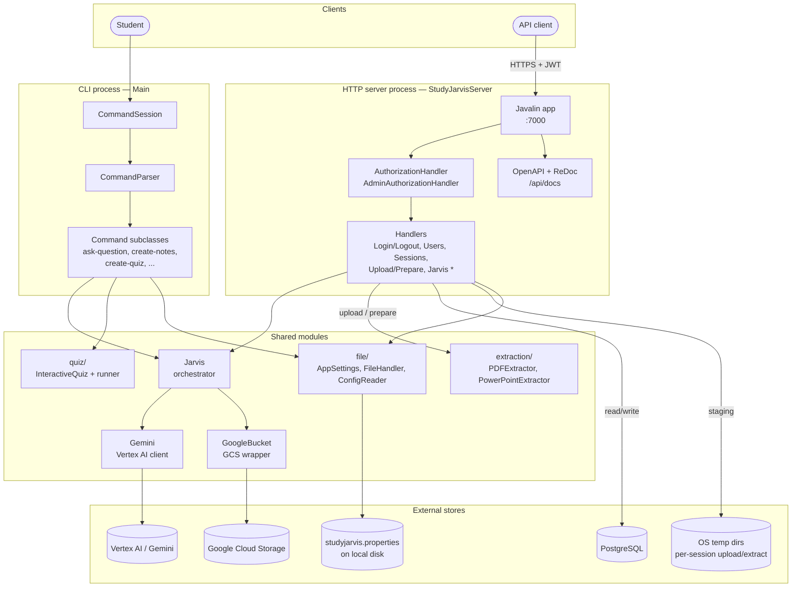

# Containers

The runtime units inside StudyJarvis and the shared modules they use.

## Responsibilities at a glance

| Container | Role |
| --- | --- |
| **CLI process** | Interactive shell; single-user; uses the local properties file for all settings. |
| **HTTP server process** | Multi-user Javalin app; adds JWT auth, PostgreSQL, and per-user GCS prefixes on top of the shared pipeline. |
| **Jarvis / Gemini / GoogleBucket** | Shared orchestration; both modes call the exact same methods here. |
| **extraction/** | Turns PDFs and PowerPoints into the files that eventually get uploaded to GCS. |
| **file/** | Config loading and local filesystem helpers (used by both modes). |
| **quiz/** | Holds quiz state between prompts; the CLI runs it interactively, the server returns the first generation as JSON. |
