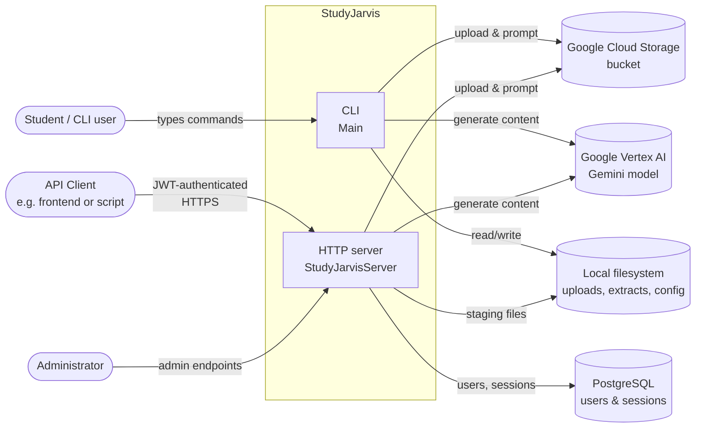

# System Context

StudyJarvis from the outside — who uses it and what it depends on.

## Notes

- The CLI is a single-user shell — it doesn't touch PostgreSQL and uses a default "user -1" GCS prefix.
- The server partitions every GCS object under a `user <userId>:` prefix so multiple users share one bucket safely.
- Both modes read the same `studyjarvis.properties` file to learn the bucket name and Gemini project/model/location.
