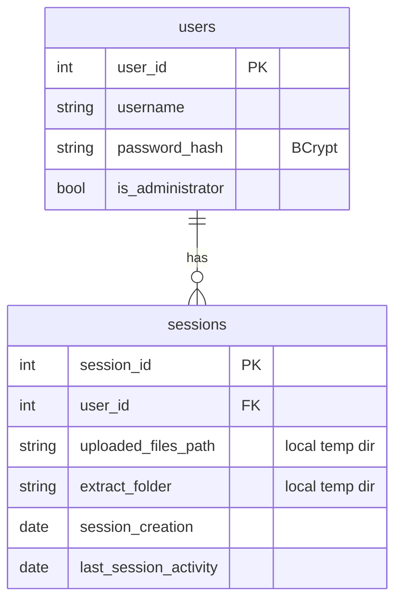

# Data Model

The server persists two tables in PostgreSQL. Schema is derived from the SQL statements in [UserReader](../../src/main/java/com/christophertbarrerasconsulting/studyjarvis/server/UserReader.java), [UserWriter](../../src/main/java/com/christophertbarrerasconsulting/studyjarvis/server/UserWriter.java), [SessionReader](../../src/main/java/com/christophertbarrerasconsulting/studyjarvis/server/SessionReader.java), and [SessionWriter](../../src/main/java/com/christophertbarrerasconsulting/studyjarvis/server/SessionWriter.java). No migrations ship with the repo — these tables must be created manually before the server can run.



## Column notes

### `users`

| Column | Source of truth | Notes |
| --- | --- | --- |
| `user_id` | [UserReader:15](../../src/main/java/com/christophertbarrerasconsulting/studyjarvis/server/UserReader.java#L15) | Surrogate key used by GCS prefix `"user <userId>:"`. |
| `username` | [UserReader:15](../../src/main/java/com/christophertbarrerasconsulting/studyjarvis/server/UserReader.java#L15) | Natural key for login and admin lookup. |
| `password_hash` | [LoginHandler:57](../../src/main/java/com/christophertbarrerasconsulting/studyjarvis/server/LoginHandler.java#L57) | BCrypt hash (`jbcrypt`). Never returned to clients. |
| `is_administrator` | [AdminAuthorizationHandler:21](../../src/main/java/com/christophertbarrerasconsulting/studyjarvis/server/AdminAuthorizationHandler.java#L21) | Gates `/secure/admin/*`. |

### `sessions`

| Column | Source of truth | Notes |
| --- | --- | --- |
| `session_id` | [SessionWriter:30](../../src/main/java/com/christophertbarrerasconsulting/studyjarvis/server/SessionWriter.java#L30) | Returned from `INSERT ... RETURNING`. |
| `user_id` | [SessionReader:11](../../src/main/java/com/christophertbarrerasconsulting/studyjarvis/server/SessionReader.java#L11) | Foreign key to `users`. |
| `uploaded_files_path` | [SessionWriter:22](../../src/main/java/com/christophertbarrerasconsulting/studyjarvis/server/SessionWriter.java#L22) | Local temp dir `upload_<userId>` created at login. |
| `extract_folder` | [SessionWriter:24](../../src/main/java/com/christophertbarrerasconsulting/studyjarvis/server/SessionWriter.java#L24) | Local temp dir `extract_<userId>` created at login. |
| `session_creation` | SQL `DATE` | Set at login. |
| `last_session_activity` | SQL `DATE` | Currently set only at creation — no code updates it today. |

## DDL sketch

The code assumes something like this; replicate it on your PostgreSQL instance:

```sql
CREATE TABLE users (
    user_id SERIAL PRIMARY KEY,
    username TEXT NOT NULL UNIQUE,
    password_hash TEXT NOT NULL,
    is_administrator BOOLEAN NOT NULL DEFAULT FALSE
);

CREATE TABLE sessions (
    session_id SERIAL PRIMARY KEY,
    user_id INTEGER NOT NULL REFERENCES users(user_id) ON DELETE CASCADE,
    uploaded_files_path TEXT NOT NULL,
    extract_folder TEXT NOT NULL,
    session_creation DATE NOT NULL,
    last_session_activity DATE NOT NULL
);
```

## Things worth knowing

- GCS is **not** in the ERD — bucket objects are keyed purely by `"user <userId>:"` prefix, not tracked in the database.
- A user can have multiple session rows; `SessionReader.getSession(userId)` returns the first one it finds, and login always creates a new one. Calling `/logout` deletes all session rows (and their temp folders) for the user.
- The `Session` DTO in [Session.java](../../src/main/java/com/christophertbarrerasconsulting/studyjarvis/user/Session.java) uses snake_case JSON keys (`uploaded_folder`, `extraction_folder`, etc.) that differ from the SQL column names — the column names in the DB are what's authoritative; the DTO is only used for JSON serialization on admin endpoints.
