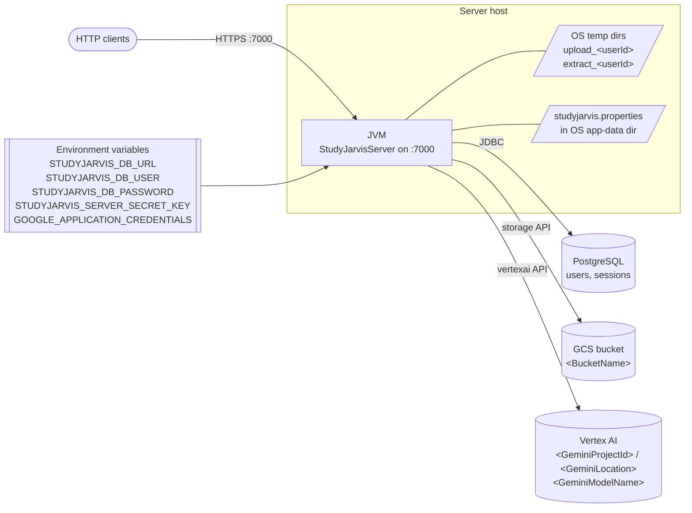

# Deployment & Config

Where the server runs, where its state lives, and every knob you need to set to get it up.

## Settings — `studyjarvis.properties`

Lives in the OS app-data directory ([AppConfigPath.java](../../src/main/java/com/christophertbarrerasconsulting/studyjarvis/file/AppConfigPath.java)):

| OS | Path |
| --- | --- |
| Windows | `%APPDATA%\studyjarvis.properties` |
| macOS | `~/Library/Application Support/studyjarvis.properties` |
| Linux | `~/.config/studyjarvis.properties` |

Keys (from [AppSettings.java](../../src/main/java/com/christophertbarrerasconsulting/studyjarvis/file/AppSettings.java)):

| Key | Used by | Purpose |
| --- | --- | --- |
| `BucketName` | `GoogleBucket` | Target GCS bucket. |
| `ExtractFolder` | CLI only (`CommandSession`) | Local folder for CLI extract operations. |
| `GeminiProjectId` | `Gemini` → VertexAI | GCP project hosting the model. |
| `GeminiModelName` | `Gemini` | e.g. `gemini-1.5-pro-002`. |
| `GeminiLocation` | `Gemini` | Region, e.g. `us-central1`. |

The CLI loads these at startup via [LoadLocalSettingsCommand](../../src/main/java/com/christophertbarrerasconsulting/studyjarvis/command/LoadLocalSettingsCommand.java). The server reads them on demand each time it constructs `Jarvis` or `GoogleBucket`.

## Environment variables (server only)

| Variable | Consumer | Purpose |
| --- | --- | --- |
| `STUDYJARVIS_DB_URL` | `Database.connect` | JDBC URL, e.g. `jdbc:postgresql://host:5432/studyjarvis`. |
| `STUDYJARVIS_DB_USER` | `Database.connect` | Postgres user. |
| `STUDYJARVIS_DB_PASSWORD` | `Database.connect` | Postgres password. |
| `STUDYJARVIS_SERVER_SECRET_KEY` | `JwtUtil` | HMAC256 key for signing JWTs. |
| `GOOGLE_APPLICATION_CREDENTIALS` | `google-cloud-*` libraries | Path to a GCP service-account key file (or use `gcloud auth application-default login`). The service account needs Vertex AI and GCS object read/write permission on the configured project and bucket. |

## Local state on the server host

- **Temp folders** per session: `upload_<userId>` and `extract_<userId>` under the OS temp dir, created at login by [SessionWriter.createSession](../../src/main/java/com/christophertbarrerasconsulting/studyjarvis/server/SessionWriter.java). They are emptied at the end of every `PrepareFilesHandler` run and deleted on logout.
- **No persistent file store** on the server — once prepared, all context lives in GCS.

## Pre-flight checklist

Before `StudyJarvisServer` can answer a request:

1. GCP project exists with Vertex AI enabled and the chosen model available in the chosen location.
2. GCS bucket exists and the service account has `storage.objectAdmin` (or equivalent) on it.
3. PostgreSQL is reachable with `users` and `sessions` tables created (see [data-model.md](data-model.md)).
4. `studyjarvis.properties` is present in the server account's app-data dir.
5. All five `STUDYJARVIS_*` / `GOOGLE_APPLICATION_CREDENTIALS` env vars are exported in the server process environment.
6. At least one admin user is inserted into `users` (passwords stored as BCrypt hashes).
