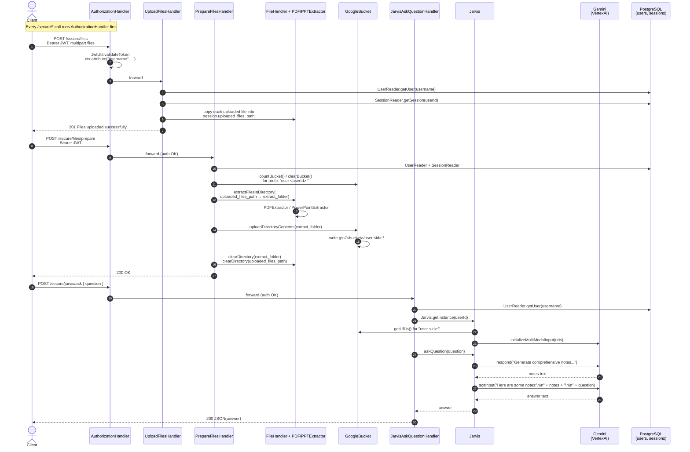

# Sequence — Ask a Question (HTTP)

The end-to-end flow a client takes to ask Gemini a question about uploaded materials. Three requests are involved: upload, prepare, ask.

## Things worth knowing

- `AuthorizationHandler` uses Javalin's `before("/secure/*", ...)` filter, so it runs ahead of every handler in the diagram above. Every handler body then reads `ctx.attribute("username")`.
- `PrepareFilesHandler` clears the bucket prefix at the start of each prepare, so repeated preparations don't accumulate stale objects.
- `Jarvis.askQuestion` uses a two-hop prompting strategy: it first asks Gemini to generate notes on all topics, then injects those notes plus the user's question into a fresh `textInput` call. The first hop (`respond`) also appends the prompt+response into `Gemini.parts` for conversational continuity within the same Jarvis instance.
- `Jarvis` is `AutoCloseable`; each handler wraps it in try-with-resources so the `VertexAI` client is closed at the end of every request.
