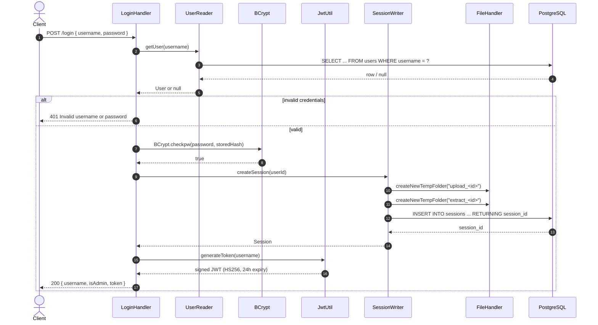
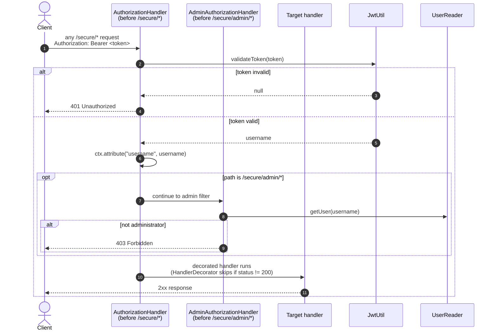
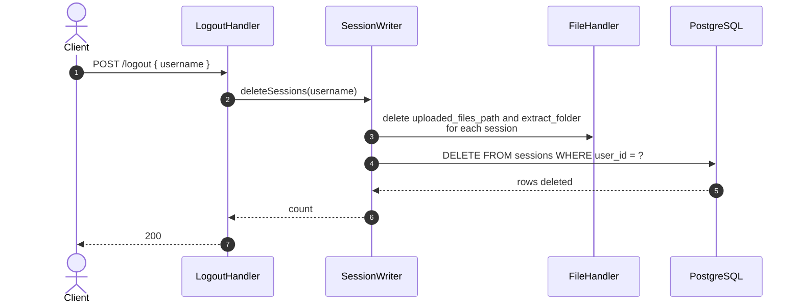

# Sequence — Login & JWT

How a user obtains and uses a JWT, how the server verifies it, and how logout tears down a session.

## Login

## Authenticated call

## Logout

## Things worth knowing

- JWT signing uses HMAC256 with `STUDYJARVIS_SERVER_SECRET_KEY` from the environment. If that env var is unset, the server will still start but every generated token will fail to verify — configure it before running.
- The token carries only `username` as a claim. `AdminAuthorizationHandler` re-queries the database on every admin request to get the `is_administrator` bit; role changes take effect immediately.
- `JwtUtil` is the class name in code even though the file is `JWTUtil.java`.
- Session rows are created **on login, not on upload**. A user who never logs in again has no session and therefore no upload/extract directories.
