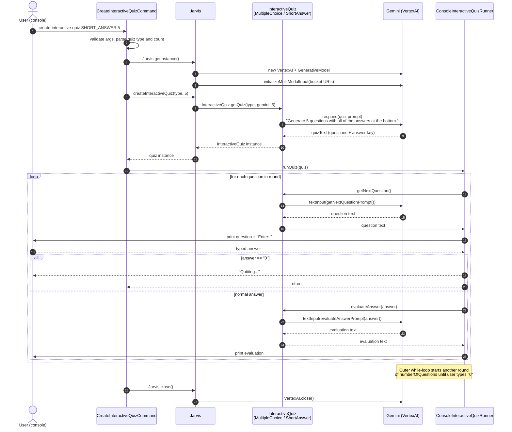

# Sequence — Interactive Quiz (CLI)

How `create-interactive-quiz` generates a quiz from the prepared GCS context and then drives a question-by-question console loop against Gemini.

## Things worth knowing

- `InteractiveQuiz.getQuiz` is a small factory: it returns a [MultipleChoiceInteractiveQuiz](../../src/main/java/com/christophertbarrerasconsulting/studyjarvis/quiz/MultipleChoiceInteractiveQuiz.java) or [ShortAnswerInteractiveQuiz](../../src/main/java/com/christophertbarrerasconsulting/studyjarvis/quiz/ShortAnswerInteractiveQuiz.java) subclass based on the CLI argument. Both subclasses override `getQuizPrompt`, `getNextQuestionPrompt`, or `evaluateAnswerPrompt` to shape Gemini's behavior.
- The initial `respond` call adds the full quiz (questions + answer key) into `Gemini.parts`, so subsequent `getNextQuestion` / `evaluateAnswer` prompts can refer back to it through multi-modal context.
- The outer `while (true)` in `ConsoleInteractiveQuizRunner.runQuiz` means the same quiz is re-iterated in rounds until the user types `0` — it does **not** generate a new quiz per round.
- The server has no equivalent handler today; interactive quizzes are CLI-only. The server exposes only the one-shot `/secure/jarvis/create-quiz`.
