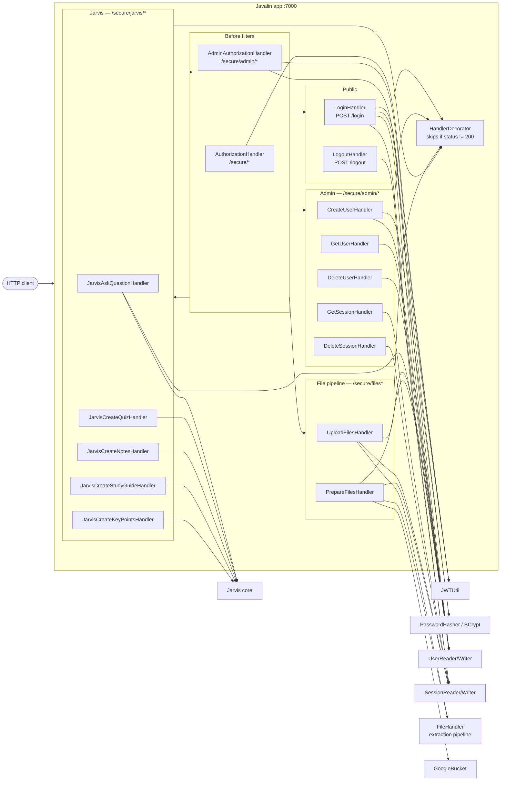

# Server Components

Handlers registered by [StudyJarvisServer.java:87-132](../../src/main/java/com/christophertbarrerasconsulting/studyjarvis/server/StudyJarvisServer.java#L87-L132), the filters that run before them, and how they reach downstream collaborators.

## Route table

| Method | Path | Handler | Auth | Purpose |
| --- | --- | --- | --- | --- |
| POST | `/login` | `LoginHandler` | — | Exchange username+password for a JWT; creates a session row |
| POST | `/logout` | `LogoutHandler` | — | Deletes the caller's sessions |
| POST | `/secure/admin/users` | `CreateUserHandler` | Admin | Creates a user |
| GET | `/secure/admin/users/{username}` | `GetUserHandler` | Admin | Fetches a user |
| DELETE | `/secure/admin/users/{username}` | `DeleteUserHandler` | Admin | Deletes a user |
| GET | `/secure/admin/sessions` | `GetSessionHandler` | Admin | Lists sessions |
| DELETE | `/secure/admin/sessions` | `DeleteSessionHandler` | Admin | Deletes sessions |
| POST | `/secure/files` | `UploadFilesHandler` | User | Saves multipart uploads into the session's `uploaded_files_path` |
| POST | `/secure/files/prepare` | `PrepareFilesHandler` | User | Extracts, uploads to GCS, clears local staging |
| POST | `/secure/jarvis/ask` | `JarvisAskQuestionHandler` | User | Answers a question using prepared GCS context |
| POST | `/secure/jarvis/create-quiz` | `JarvisCreateQuizHandler` | User | Generates a quiz |
| POST | `/secure/jarvis/create-notes` | `JarvisCreateNotesHandler` | User | Generates comprehensive notes |
| POST | `/secure/jarvis/create-study-guide` | `JarvisCreateStudyGuideHandler` | User | Generates a Q&A study guide |
| POST | `/secure/jarvis/create-key-points` | `JarvisCreateKeyPointsHandler` | User | Generates key-point bullets |

## Cross-cutting patterns

- **`HandlerDecorator`** — every handler is wrapped via `HandlerDecorator.getInstance(...)`. If an earlier `before` filter (e.g. `AuthorizationHandler`) set a non-200 status, the decorator short-circuits and the real handler never runs. That's how auth rejections stop the chain without per-handler checks.
- **`AuthorizationHandler`** — reads `Authorization: Bearer <jwt>`, validates with `JwtUtil`, sets `ctx.attribute("username", ...)` for downstream handlers to read.
- **`AdminAuthorizationHandler`** — runs only for `/secure/admin/*`, re-parses the JWT, looks up the user, and forces a 403 if `is_administrator` is false.
- **OpenAPI + ReDoc** — every handler class has `@OpenApi` annotations; the spec is served at `/api/openapi` and rendered at `/api/docs`.
